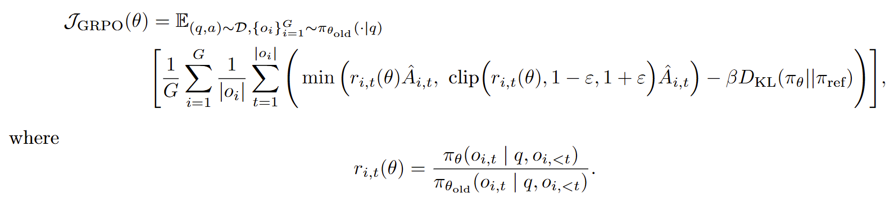
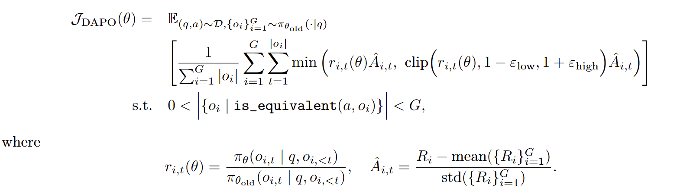
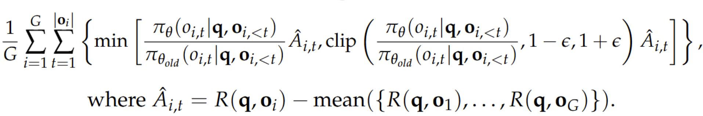

# Summary of Papers in Awesome-GRPO
[](https://awesome.re) 


🔥 A curated and extensible repository for **GRPO** and its **variants**, combining both *code implementations* and *paper collections* for advanced **LLM reinforcement fine-tuning**.


## 1. GRPO — *Group Relative Policy Optimization*

> DeepSeekMath: Pushing the Limits of Mathematical Reasoning in Open Language Models

### (1) Core Concept

* GRPO belongs to a **value-function-free** reinforcement learning paradigm.
* For each prompt, a **group of response sequences** is sampled, and the **group-average reward** serves as the baseline for computing relative advantages.
* This design eliminates the need to train a separate value model, **significantly simplifying the PPO pipeline** while maintaining stable optimization.

### (2) Training Procedure

1. For each prompt $q$, sample $G$ response sequences ${o_1, \dots, o_G}$ from the policy $\pi_\theta$.
2. Compute a scalar reward $r_i \in {0, 1}$ for each sequence (1 for correct, 0 for incorrect).
3. Use the group-average reward as the baseline.
4. Compute the relative advantage $\hat{A}_i$ for each sequence.
5. Update the policy using a PPO-style clipped objective function.

### (3) Objective (Paper Version)




### (4) Run GRPO

```bash
# Start reference server
CUDA_VISIBLE_DEVICES=7 python ref_client.py

# Launch training
CUDA_VISIBLE_DEVICES=2,3,4,5,6 deepspeed train.py --algo grpo

```


## 2. DAPO — *Dynamic Sampling Policy Optimization*

> DAPO: An Open-Source LLM Reinforcement Learning System at Scale


### (1) Core Concept

Compared with GRPO, DAPO refines the **sampling** and **normalization** mechanisms to enhance both **training stability** and **exploration capacity**, featuring several key improvements:


#### 1) **Decoupled Clip**

**The upper and lower clipping bounds are decoupled to prevent entropy collapse.**

In standard symmetric clipping:

* When $\rho_i > 1 + \epsilon$: the update is penalized for being overly aggressive.
* When $\rho_i < 1 - \epsilon$: the update is suppressed for reducing the probability too much.

While symmetric clipping works well in small-scale RL, it becomes problematic in sequence-level policy optimization for LLMs, leading to:

* **Reward skewness:** LLM reward distributions are highly asymmetric (few high-reward samples, many low-reward ones). Symmetric clipping causes high-reward samples to be prematurely truncated, resulting in under-optimization.
* **Gradient imbalance:** When $A_i > 0$, samples are more likely to hit the upper clip bound $1+\epsilon$, whereas $A_i < 0$ samples seldom reach the lower bound $1-\epsilon$. This gradient flattening weakens the update from positive samples, slowing or even destabilizing convergence.

In other words, **symmetric clipping penalizes good samples too much and bad samples too little**.


#### 2) **Dynamic Sampling**

**Skip fully correct or fully incorrect groups to improve the effective gradient ratio.**

When a given prompt achieves perfect accuracy (accuracy = 1), existing RL algorithms suffer from **gradient degeneration**.

For example, under GRPO, if all responses for a specific prompt are correct and receive identical rewards, the group advantage becomes zero.

Zero advantage leads to zero policy gradient, shrinking the overall update magnitude and increasing batch gradient noise sensitivity—thus lowering sample efficiency.


#### 3) **Token-Level Averaging**

**Average the loss across all tokens directly, instead of performing sequence-level then batch-level averaging, to reduce variance.**

The original GRPO computes per-sample losses by first averaging over tokens within each sequence and then averaging across samples, giving equal weight to all sequences in the batch.

However, since the reward is **sequence-level** while updates are based on **token-level** probability ratios:

* When averaged per sequence, short and long sequences receive equal weight; the gradients of long sequences are diluted, weakening their optimization signal.
* Long sequences accumulate more token-level noise, while short ones have smaller variance; equal weighting biases the global gradient direction toward short-sequence samples.

By averaging directly over all valid tokens in the batch, DAPO effectively reduces gradient variance and stabilizes optimization.


#### 4) **Removing the KL Term**

DAPO omits the explicit KL-regularization term used in GRPO to further simplify the optimization and rely solely on implicit distributional regularity from dynamic sampling.


### (2) Training Procedure

1. Similar to GRPO, sample multiple response sequences for each prompt and compute their rewards.
2. Dynamically discard uninformative batches (e.g., all-correct or all-wrong).
3. Compute a unified advantage for all tokens within each sequence.
4. Average the loss across all tokens and update the policy accordingly.


### (3) Objective (Paper Version)




### (4) Run DAPO

```bash
# Start reference server
CUDA_VISIBLE_DEVICES=7 python ref_client.py

# Launch training
CUDA_VISIBLE_DEVICES=2,3,4,5,6 deepspeed train.py --algo dapo

```


## 3. Dr.GRPO

> Understanding R1-Zero-Like Training: A Critical Perspective


### (1) Core Concept

Dr.GRPO addresses the optimization biases identified in standard GRPO, specifically, the **response-length bias** and the **question-difficulty bias**.

In vanilla GRPO, dividing by the sequence length $|o_i|$ and the group-level standard deviation $\text{std}({R(q,o_1),...,R(q,o_G)})$ introduces unintended weighting effects:

* Short correct responses are overemphasized (length bias).
* Easier questions (lower variance in group rewards) get disproportionately higher gradient updates (difficulty bias).

**Dr.GRPO** eliminates these biases by:

1. Removing both normalization terms ($1/|o_i|$ and $\text{std}$).
2. Using a fixed constant (e.g., generation budget) instead of `mask.sum(axis=dim)` in the masked mean function for unbiased averaging.
3. Recovering a pure PPO-style objective where advantages are estimated using Monte Carlo returns with an unbiased baseline.

This modification yields a clean, unbiased RL objective that retains GRPO’s simplicity but avoids systematic preference for long or short responses.


### (2) Training Procedure

1. Implemented using the Oat framework (modular and efficient RL for LLMs).
2. The base model is Qwen2.5-1.5B, fine-tuned with the R1 template under online RL.
3. The reward function is binary and verification-based (using Math-Verify2):
   $$
   R(q,o)=
   \begin{cases}
   1 & \text{if } o \text{ contains the correct final answer}\
   0 & \text{otherwise}
   \end{cases}
   $$


### (3) Objective (Paper Version)




### (4) Run Dr.GRPO

```bash
# Start reference server
CUDA_VISIBLE_DEVICES=7 python ref_client.py

# Launch training
CUDA_VISIBLE_DEVICES=2,3,4,5,6 deepspeed train.py --algo drgrpo
```


## 4. GTPO — *Group Token Policy Optimization*

> GTPO AND GRPO-S: TOKEN AND SEQUENCE-LEVELREWARD SHAPING WITH POLICY ENTROPY


## 5. GRPO-S — *Sequence-Level Entropy-Weighted GRPO*

> GTPO AND GRPO-S: TOKEN AND SEQUENCE-LEVELREWARD SHAPING WITH POLICY ENTROPY


